# PMAact3_t4 — CRUD Spring Boot con relación JPA (Libro / Autor)

**Instituto Tecnológico de Oaxaca**

Proyecto: CRUD en Spring Boot conectado a MySQL, con una relación `@ManyToOne` / `@OneToMany` entre dos entidades (**Libro** y **Autor**), vistas propias con Thymeleaf y despliegue en VPS.

**Materia**: Programación Web

**Profesora**: Adelina Martinez Nieto

**Alumna**: Pliego Mendez Alondra

## Objetivo

Que el estudiante construya un CRUD completo en Spring Boot conectado a una base de datos real (MySQL), implementando al menos una relación entre entidades, y probándolo con sus propias vistas dentro del mismo proyecto y con Postman/Bruno, o ambos — todo dentro del mismo proyecto Spring Boot, sin crear un proyecto de frontend separado (como React) todavía.

---

## Descripción del proyecto

Este proyecto es un sistema CRUD (Crear, Leer, Actualizar, Eliminar) para la gestión simulada de una pequeña biblioteca, desarrollado con Spring Boot 4 y Spring Data JPA, conectado a una base de datos MySQL local. Permite registrar autores y libros, relacionando cada libro con su autor correspondiente mediante una relación muchos a uno. El proyecto cuenta con vistas propias construidas con Thymeleaf usando @Controller en vez de @RestController con el objetivo de tener mayor facilidad para la presentación de las vistas y la llamada a los endpoints, incluye un buscador de libros por título, y valida los datos antes de guardarlos, mostrando mensajes de confirmación o error según es necesario. El proyecto está desplegado en un VPS con HTTPS mediante sslip.io para mantener la parte de la seguridad.

---

## Entidades y relación

- **Entidades:** `Libro` y `Autor`
- **Tipo de relación:** Muchos a uno `@ManyToOne` en Libro de forma unidireccional — un Autor puede tener muchos Libros, un Libro pertenece a un solo Autor
- **Llave foránea:** `autor_id` en la tabla `libro`

---

## Tecnologías 

- Spring Boot 4.1.0
- Spring Data JPA / Hibernate
- Thymeleaf
- MySQL 8.0
- Maven

---

## Capturas de pantalla

### Entidades relacionadas (Libro y Autor)
Autor
``` java
@Entity
@Table(name = "autor")
public class Autor {
@Id
    @GeneratedValue(strategy = GenerationType.IDENTITY)
    private Integer id;

    @Column(name = "nombre")
    private String nombre;

    @Column(name = "nacionalidad")
    private String nacionalidad;

    @Column(name = "fecha_nacimiento")
    private LocalDate fechaNacimiento;
}
``` 

Libro
``` java
@Entity
@Table(name = "libro")
public class Libro {
    @Id
    @GeneratedValue(strategy = GenerationType.IDENTITY)
    private Integer id;

    @Column(name = "titulo")
    private String titulo;

    @ManyToOne
    @JoinColumn(name = "autor_id")
    private Autor autor;

    @Column(name = "año_publicacion")
    private Integer añoPublicacion;

    @Column(name = "genero")
    private String genero;

    @Column(name = "copias_disponibles")
    private Integer copiasDisponibles;
``` 
### CRUD Vista Inicial
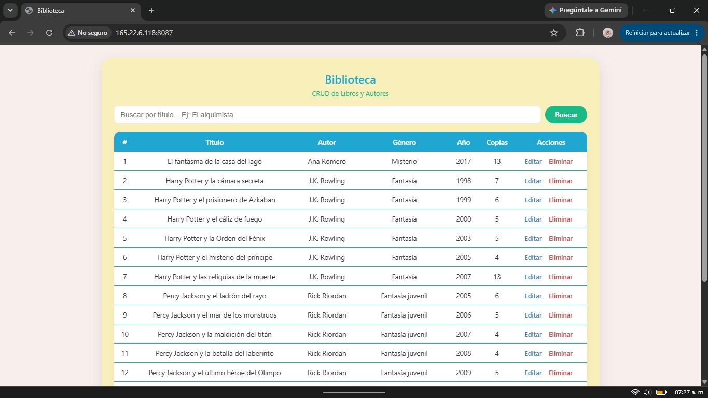

### CRUD — Crear


Muestra de la tabla en terminal de la base de datos del vps.

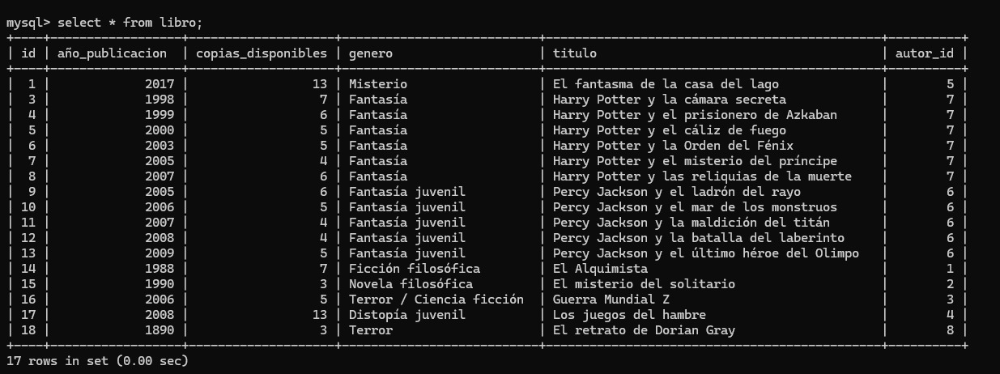

Si el autor no existe, el usuario tiene la opcion de crear uno nuevo para el libro que desee añadir, se corrobora la relación adecuada mediante el nombre del autor siendo mostrado en la tabla de libros.

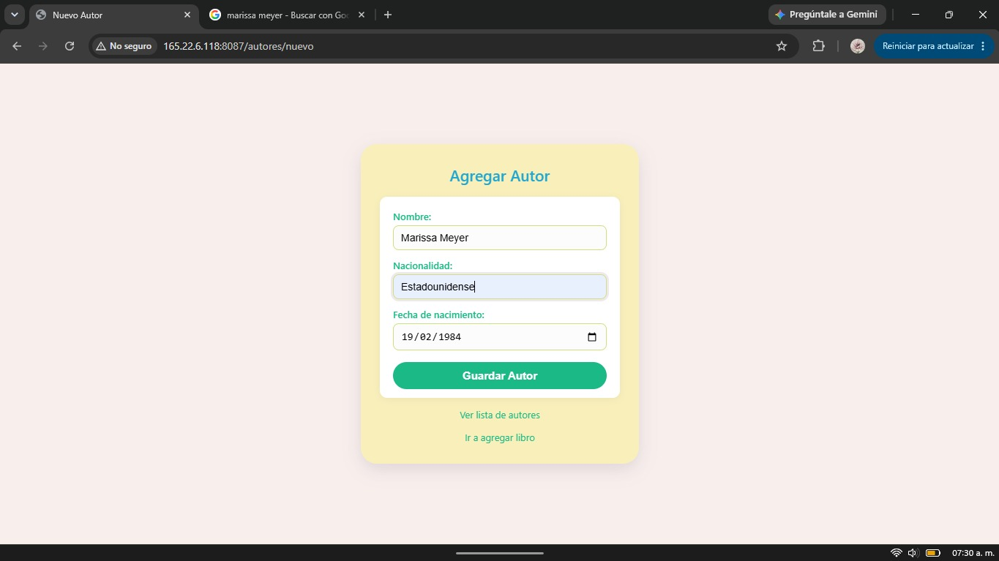

Formulario de libro con boton de guardar que es el llama al endpoint de post, para añadir un nuevo elemento a la lista.

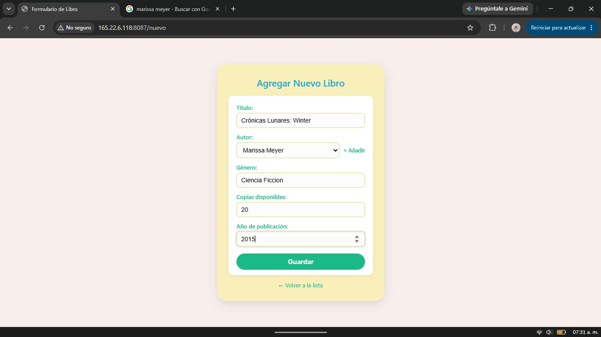

Confirmacion del nuevo elemento añadido

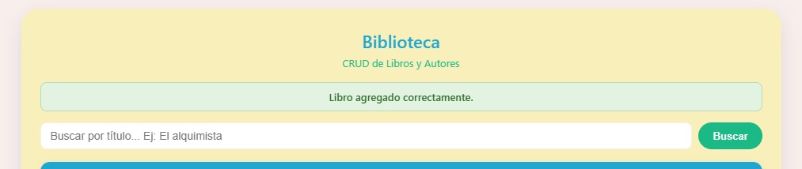

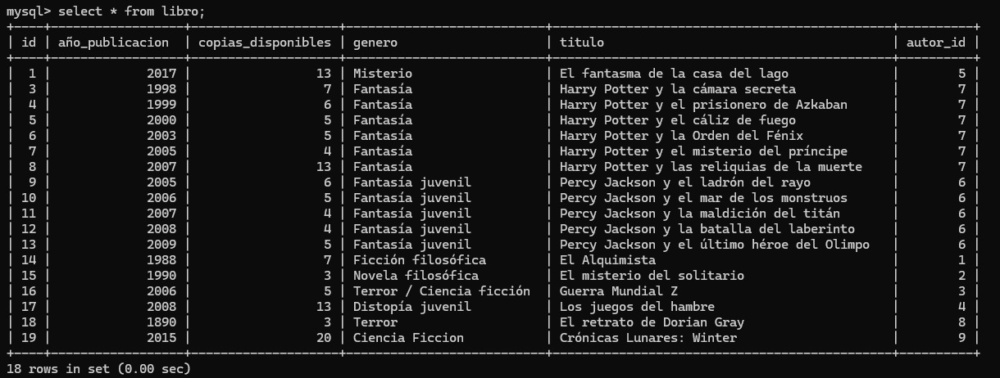

### CRUD — Actualizar
Sobre cada elemento se pueden realizar dos acciones o editarlo o eliminarlo.

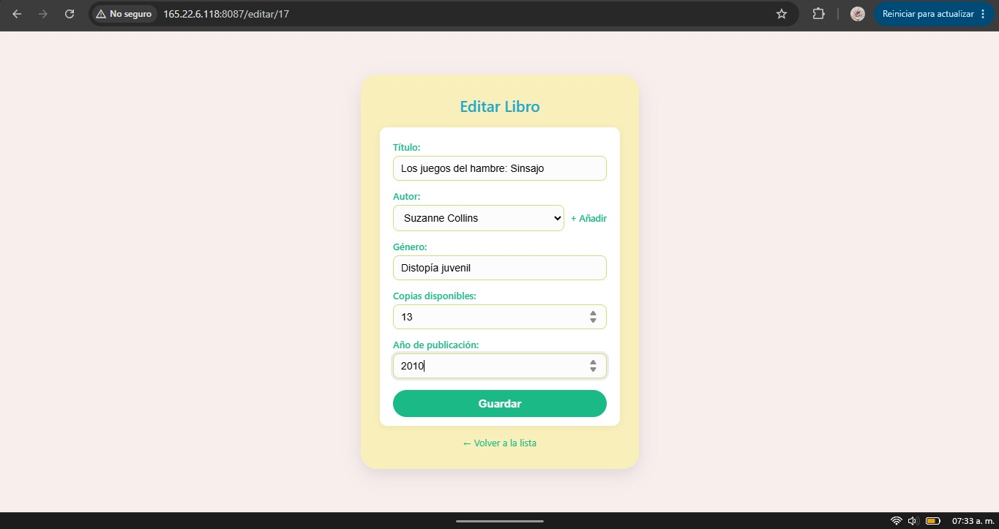

Confirmacion de la edicion sobre el elemento seleccionado.

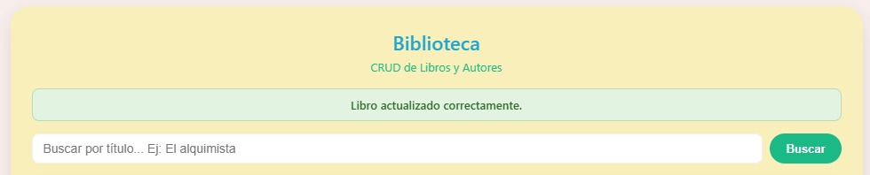

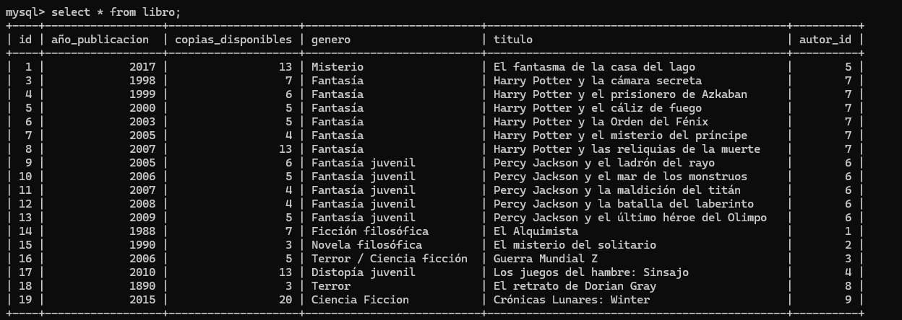

### CRUD — Eliminar


Confirmación de la eliminacion del elemento seleccionado.
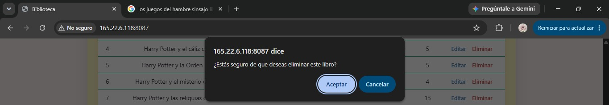
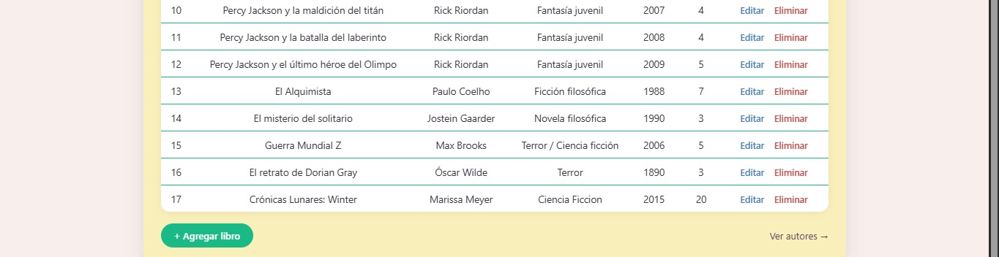
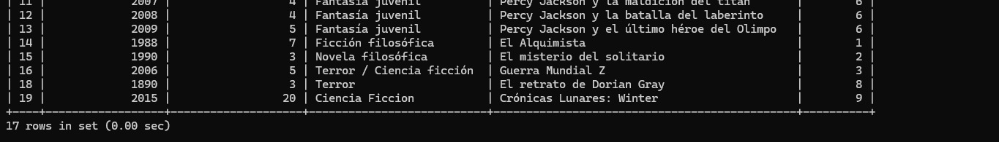

---

## Cómo correr el proyecto localmente

```bash
git clone https://github.com/AlondraPliego/PMAact3_t4.git
cd PMAact3_t4
```

1. Crea una base de datos MySQL local llamada `PMAact3_crud`
2. Copia `application.properties.example` a `application.properties` y coloca tus propias credenciales
3. Corre el proyecto:

```bash
mvn spring-boot:run
```

4. Abre en el navegador: `http://localhost:8080/`

---

## Despliegue

- **Repositorio de GitHub:** https://github.com/AlondraPliego/PMAact3_t4
- **Proyecto corriendo en el VPS:** https://165-22-6-118.sslip.io
- **Colección de Postman/Bruno:**  https://github.com/AlondraPliego/PMAact3_t4/blob/main/PMAact3_t4_Libros.postman_collection.json
---

## Fuentes de Consulta
- Bezkoder. (2023, 3 octubre). JPA One To Many example with Hibernate and Spring Boot - BezKoder. BezKoder. https://www.bezkoder.com/jpa-one-to-many/#google_vignette
- CodingNomads. (s. f.). Spring Data JPA Repositories for Efficient Database Operations. https://codingnomads.com/spring-data-jpa-repository
- EdTics Academy. (2026, 29 marzo). Crear CRUD con Spring Boot, Java y MySQL en NetBeans | Paso a Paso 2026 [Vídeo]. YouTube. https://www.youtube.com/watch?v=uTwxbOnwB9k

#### Nota:
- Los libros que se continuen agregando comenzaran con el id: 43.
- El id del primer libro es 20 "El fantasma de la casa del lago"


